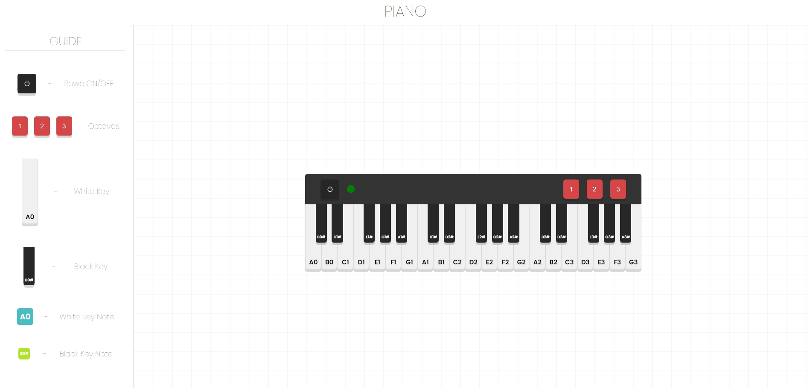

# PianoAngular

This project was generated using [Angular CLI](https://github.com/angular/angular-cli) version 19.0.4.

## Web Page

Netifly: https://piano-angular-playground.netlify.app/

## Example Design

Figma: https://www.figma.com/proto/l0bUdWbPzjuSGKLmw1cWcp/Untitled?node-id=21-3&t=7t3RsFHCYykh2MCf-1&starting-point-node-id=21%3A3

## Image Real-Time

